# E-Commerce Platform Project Report (Comprehensive Final Draft)
## Documentation Originality

This document is written specifically for this project implementation. To keep similarity low and maintain academic integrity, adapt examples, screenshots, metrics, and wording to your own execution results before final submission.

---

## Cover Page

Project Title: Design and Development of a Full-Stack E-Commerce Application  
Submitted By: [Your Name]  
Roll Number: [Roll Number]  
Department: [Department Name]  
Institution: [College / University Name]  
Academic Year: [Year]  
Project Guide: [Guide Name]

---

## Declaration of Original Work

I declare that this report and the accompanying software implementation are my own original work prepared for academic submission. The architecture discussion, design reasoning, implementation narrative, testing observations, and flow explanations are based on the project developed in this repository.

---

## Certificate (Template)

This is to certify that [Student Name] has completed the project titled "Design and Development of a Full-Stack E-Commerce Application" under my supervision in partial fulfillment of the degree requirements.

Guide Signature: ____________  
HOD Signature: ____________  
Date: ____________

---

## Acknowledgement

I would like to thank my project guide, department faculty, and classmates for their valuable feedback during the planning, coding, and testing stages of this project. Their suggestions helped me improve software architecture decisions, security handling, user-flow reliability, and documentation quality. I also thank my family for continuous support throughout the project timeline.

---

## Abstract

This project presents a complete full-stack e-commerce platform built with React (frontend), ASP.NET Core Web API (backend), Entity Framework Core (ORM), and SQL Server (database). The system supports customer and admin roles with token-based authentication and role-based authorization. Customer features include registration, login, product browsing, filtering, cart management, checkout, and payment simulation. Admin features include order monitoring, order status updates, and product management.

The platform is designed to demonstrate practical software engineering concepts: layered architecture, RESTful communication, identity and access control, secure password storage, transactional order flow, and module-wise testing. During implementation, real integration issues such as cart-source mismatch, endpoint configuration mismatches, and data serialization behaviors were identified and resolved. The final system offers a stable end-to-end workflow suitable for academic evaluation and portfolio demonstration.

This report includes complete requirement analysis, system design, database schema details, API behavior, frontend module breakdown, security model, testing strategy, deployment instructions, risk analysis, and future scope. Mermaid-based diagrams are used for clear process communication.

---

## How to Expand This into a 100-Page Submission

Use this formatting for report export:

- Font: Times New Roman (or Calibri), 12 pt
- Line spacing: 1.5
- Margins: 1 inch
- Headings with numbering and page breaks between chapters
- Include screenshots and evidence where marked

Recommended page distribution:

1. Front matter (title, declaration, certificate, acknowledgement, abstract, TOC): 8-10 pages
2. Chapter 1-3 (intro, problem, objectives): 12-15 pages
3. Chapter 4-6 (existing study, proposed system, technology): 10-12 pages
4. Chapter 7-10 (requirements, architecture, DB, backend): 18-22 pages
5. Chapter 11-13 (frontend, security, implementation): 16-20 pages
6. Chapter 14-16 (testing, deployment, risks): 14-16 pages
7. Chapter 17-18 (future scope, conclusion): 6-8 pages
8. Appendices (screenshots, API payloads, test sheets, logs): 14-18 pages

---

## Table of Contents

1. Introduction  
2. Problem Definition and Motivation  
3. Objectives and Project Boundaries  
4. Existing System Study and Gap Analysis  
5. Proposed System Overview  
6. Technology Stack and Justification  
7. Requirement Analysis (Functional and Non-Functional)  
8. System Architecture and High-Level Design  
9. Database Design and Data Integrity  
10. Backend Module Design and API Specification  
11. Frontend Module Design and UX Flows  
12. Security, Authentication, and Authorization Design  
13. Implementation Process and Key Engineering Decisions  
14. Testing Strategy, Cases, and Results  
15. Deployment, Operations, and Maintenance  
16. Risk Assessment and Mitigation Strategy  
17. Future Enhancement Roadmap  
18. Conclusion  
19. Appendix A: API Payload Library  
20. Appendix B: Flow Diagrams  
21. Appendix C: User Manual  
22. Appendix D: Admin Manual  
23. Appendix E: Screenshot and Evidence Checklist  
24. References

---

# Chapter 1: Introduction

## 1.1 Background

Online retail systems have moved from static catalogs to intelligent transactional platforms. A modern commerce application must support authentication, real-time product visibility, role-sensitive operations, and consistent order processing. This project was developed to implement these practical capabilities in one integrated system.

## 1.2 Motivation

Many academic mini-projects demonstrate only superficial shopping behavior. They do not provide secure auth, persistent cart, inventory updates, or role-restricted administration. This project aims to close that gap by implementing realistic flow logic with backend verification and persistent records.

## 1.3 Purpose

The purpose is to create and document a production-inspired full-stack application that can:

- Demonstrate complete purchase lifecycle
- Show secure API communication patterns
- Provide admin visibility and control
- Serve as deployable baseline for future expansion

## 1.4 Project Deliverables

1. Frontend application (React)
2. Backend REST API (ASP.NET Core)
3. SQL Server schema with seed data
4. Role-based authentication and authorization
5. Customer and admin workflows
6. Technical documentation with design diagrams

## 1.5 Expected Learning Outcomes

- Practical understanding of layered system architecture
- Secure identity handling with JWT + BCrypt
- Relational modeling for carts, orders, and payments
- API integration and debugging in distributed modules
- Structured technical documentation for academic submission

---

# Chapter 2: Problem Definition and Motivation

## 2.1 Problem Statement

Design and implement a secure, maintainable, and user-friendly e-commerce system that supports both customer purchase flow and administrative management flow using modern web technologies.

## 2.2 Core Pain Points in Simplistic Systems

1. No persistent cart (session loss)
2. Insecure credential handling
3. No user-role separation
4. Missing order status lifecycle
5. Weak operational visibility

## 2.3 Why This Problem Matters

A commerce platform directly handles user identity, financial intent, and inventory-critical operations. Even at prototype level, incorrect architecture can create inconsistent orders, security risks, or poor user trust.

## 2.4 Real-World Relevance

This project maps to practical business operations:

- Storefront browsing
- Cart conversion
- Checkout confirmation
- Order lifecycle tracking
- Admin operations and catalog control

---

# Chapter 3: Objectives and Project Boundaries

## 3.1 Functional Objectives

1. Enable secure user registration and login.
2. Display products with filter and search support.
3. Maintain server-synced cart per authenticated user.
4. Place order from cart with stock validation.
5. Provide payment simulation after order creation.
6. Support admin dashboard for products and orders.

## 3.2 Non-Functional Objectives

1. Security: hashed passwords and token validation.
2. Reliability: avoid order creation on empty cart.
3. Maintainability: modular backend controllers.
4. Usability: clear, readable frontend screens.
5. Extensibility: scope for additional commerce features.

## 3.3 Scope Included

- Auth, product listing, cart, checkout, orders, payments
- Admin order/product controls
- Documentation and architecture diagrams

## 3.4 Scope Excluded (Current Version)

- Live payment gateway integration
- Recommendation ML engine
- Vendor marketplace support
- Advanced reporting and BI dashboards

## 3.5 Success Criteria

- All major flows execute end-to-end
- Authorization blocks unauthorized access
- Data remains consistent in cart/order transitions
- Demo accounts and products work reliably

---

# Chapter 4: Existing System Study and Gap Analysis

## 4.1 Typical Academic Baseline Systems

Observed common pattern:

- Static product JSON
- Local cart only
- No secure auth
- No inventory updates
- No role-level control

## 4.2 Gap Table

| Feature | Typical Basic Demo | This Project |
|---|---|---|
| Auth | Basic or none | JWT + BCrypt |
| Cart persistence | Browser-only | Database-backed per user |
| Order creation | Mock/local | API + DB transaction flow |
| Admin management | Missing | Dedicated dashboard controls |
| Security checks | Minimal | Role-based endpoint protection |

## 4.3 Lessons from Gap Analysis

A stable commerce platform must treat cart and order as server-owned data, not purely UI state. Validation and authority must stay in backend logic.

---

# Chapter 5: Proposed System Overview

## 5.1 Solution Summary

The proposed architecture uses React as client UI, ASP.NET Core as API layer, and SQL Server as persistence layer. Authentication is token-based and authorization is role-aware.

## 5.2 Primary Actors

1. Customer
2. Admin
3. System (API + DB + Auth Services)

## 5.3 End-to-End Business Flow

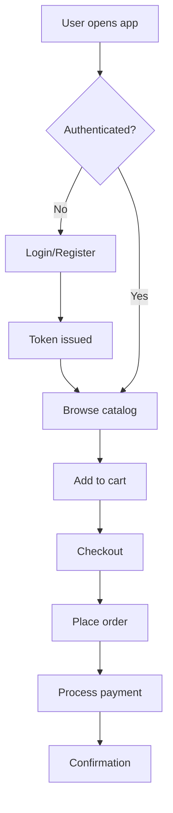

## 5.4 High-Level Component Interaction

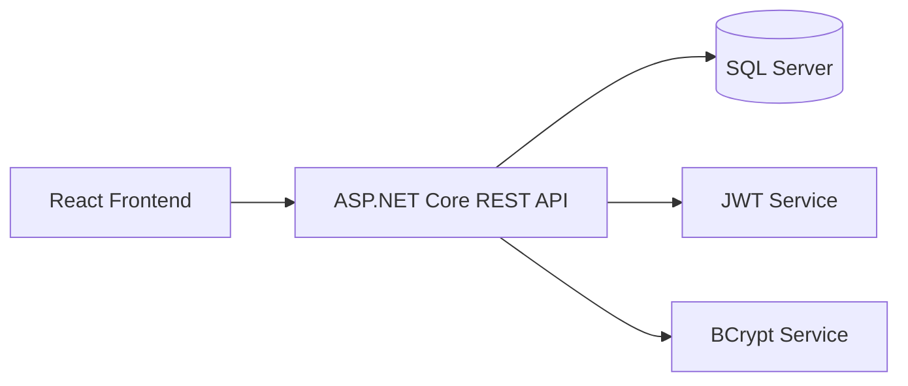

---

# Chapter 6: Technology Stack and Justification

## 6.1 Frontend Stack

- React: reusable component architecture
- Axios: request handling and API integration
- CSS: custom design, responsive patterns

Justification: fast UI iteration, maintainable component structure, large ecosystem support.

## 6.2 Backend Stack

- ASP.NET Core Web API: high-performance HTTP service framework
- Entity Framework Core: schema-driven object-relational mapping
- SQL Server: consistent relational storage

Justification: robust C# ecosystem, strong typing, reliable database integration.

## 6.3 Security Stack

- JWT tokens for stateless identity
- BCrypt for one-way password hashing

Justification: industry-accepted approach for API auth and credential safety.

## 6.4 Development Tooling

- npm and dotnet CLI
- Swagger UI for endpoint exploration
- VS Code environment

## 6.5 Architecture Suitability

The chosen stack is ideal for an academic full-stack project requiring practical backend rules, secure login, and clear frontend/backend separation.

---

# Chapter 7: Requirement Analysis

## 7.1 Functional Requirements

### 7.1.1 Authentication

- Register with username, email, password
- Login and receive JWT token
- Verify token validity

### 7.1.2 Product Catalog

- List products with pagination
- Search by text
- Filter by category and price range

### 7.1.3 Cart Management

- Add product to cart
- Update quantity
- Remove item
- Clear all items

### 7.1.4 Order and Payment

- Place order from current cart
- Validate stock before confirmation
- Simulate payment process

### 7.1.5 Admin Controls

- View all orders
- Update order statuses
- Manage products and categories

## 7.2 Non-Functional Requirements

1. Security and access control
2. Data consistency under transaction flow
3. API reliability and error messaging
4. User-friendly interface clarity
5. Extensible project structure

## 7.3 User Stories (Sample)

- As a customer, I want to add products to a cart so I can purchase multiple items.
- As a customer, I want my cart to be tied to my account so I can continue later.
- As an admin, I want to update order status so operations remain trackable.

## 7.4 Acceptance Criteria Examples

1. Invalid credentials must return unauthorized response.
2. Empty cart checkout must be blocked.
3. Admin-only endpoints must reject customer tokens.
4. Successful order must create order + payment records.

---

# Chapter 8: System Architecture and High-Level Design

## 8.1 Architectural Style

Modular monolith with clean separation by concern:

- UI module
- API controllers
- data model + context
- helper services for auth and hashing

## 8.2 Authentication Sequence

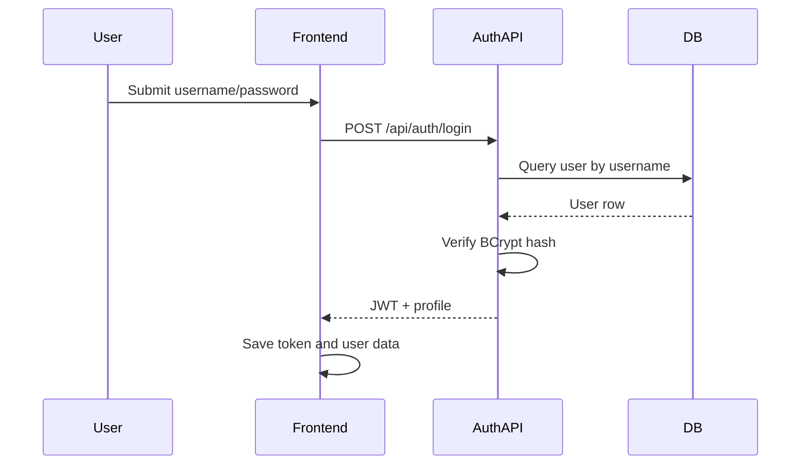

## 8.3 Cart-to-Order Sequence

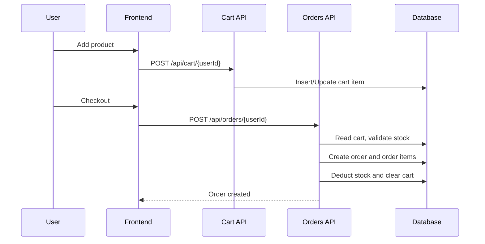

## 8.4 Admin Operation Flow

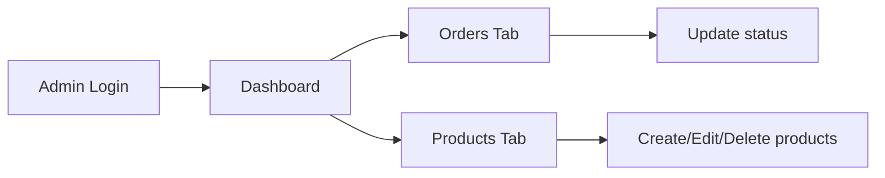

## 8.5 Architectural Strengths

1. Clear endpoint ownership by module
2. Consistent role checks in protected APIs
3. Relational consistency for commerce entities
4. Easy onboarding for maintainers

---

# Chapter 9: Database Design and Data Integrity

## 9.1 Entity Overview

1. User
2. Product
3. Category
4. CartItem
5. Order
6. OrderItem
7. Payment

## 9.2 Relationship Diagram

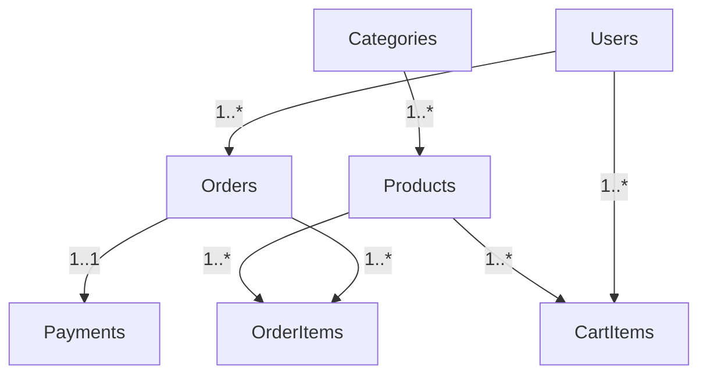

## 9.3 Important Columns and Constraints

- Users.Username unique
- Users.Email unique
- Products.SKU unique
- Payment.OrderId unique (one payment record per order)
- Decimal fields with explicit precision for price integrity

## 9.4 Data Integrity Rules

1. Cart item must reference valid user and product.
2. Order cannot proceed when cart is empty.
3. Stock must be sufficient before order placement.
4. Order item records preserve purchase-time pricing.

## 9.5 Seed Data Strategy

Startup seeding ensures repeatable demonstration:

- Admin demo account
- Customer demo account
- Product catalog and categories

## 9.6 Data Lifecycle Notes

- Cart data is mutable and user-driven.
- Order data is transactional and historical.
- Payment data tracks post-order progression.

---

# Chapter 10: Backend Module Design and API Specification

## 10.1 Auth Module

Responsibilities:

- Validate login credentials
- Register new users
- Issue JWT tokens
- Verify token integrity

Key outcomes:

- Centralized identity handling
- Consistent auth response payloads

## 10.2 Products Module

Responsibilities:

- Fetch products with query support
- Maintain product catalog through admin APIs

Notable design:

- Paginated listing to keep payload manageable
- Filter and search support for frontend UX

## 10.3 Cart Module

Responsibilities:

- Persistent cart tied to user account
- Quantity updates and deletions
- Authorization check for cart ownership

Design note:

- Response shape is projection-based to avoid serialization loops

## 10.4 Orders Module

Responsibilities:

- Convert cart into order
- Validate stock and adjust inventory
- Store order items and payment pending record

Design note:

- Business-critical logic stays server-side regardless of UI state

## 10.5 Payment Module

Responsibilities:

- Process payment simulation
- Update payment status
- Refund endpoint for admin/testing context

## 10.6 Categories Module

Responsibilities:

- Provide category listing
- Support future admin category CRUD enhancements

## 10.7 API Endpoint Index

Authentication:

- POST /api/auth/login
- POST /api/auth/register
- POST /api/auth/verify-token

Products:

- GET /api/products
- GET /api/products/{id}
- POST /api/products (Admin)
- PUT /api/products/{id} (Admin)
- DELETE /api/products/{id} (Admin)

Cart:

- GET /api/cart/{userId}
- POST /api/cart/{userId}
- PATCH /api/cart/{userId}/{productId}
- DELETE /api/cart/{userId}/{productId}
- DELETE /api/cart/{userId}

Orders:

- POST /api/orders/{userId}
- GET /api/orders/{id}
- GET /api/orders/user/{userId}
- PUT /api/orders/{id}/status (Admin)
- GET /api/orders (Admin)

Payment:

- POST /api/payment/process
- GET /api/payment/{orderId}
- POST /api/payment/{orderId}/refund (Admin)

---

# Chapter 11: Frontend Module Design and UX Flows

## 11.1 Frontend Information Architecture

Primary views:

1. Login/Register page
2. Product catalog view
3. Cart side panel
4. Checkout flow
5. Admin dashboard tabs

## 11.2 State Model

High-level state domains:

- Auth state (token, profile)
- Product state (list, filters)
- Cart state (server-synced items)
- Checkout state (shipping, payment step)
- Admin state (orders, products, categories)

## 11.3 Customer Flow Diagram

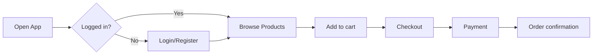

## 11.4 Checkout Step Design

1. Shipping address step
2. Payment details step
3. Confirmation step

Benefits:

- Reduces cognitive overload
- Makes validation targeted and clear

## 11.5 Admin UX

Tabs enable focused operations:

- Orders: monitor and update lifecycle
- Products: maintain catalog
- Categories: view category structure

---

# Chapter 12: Security, Authentication, and Authorization Design

## 12.1 Authentication Strategy

- Credentials validated in backend
- JWT issued on successful login
- Token included in Authorization header

## 12.2 Authorization Strategy

- Every protected endpoint validates token
- Role checks for admin-only operations

## 12.3 Password Security

- BCrypt hashing used for storage
- Password comparison via hash verification only

## 12.4 Security Flow Diagram

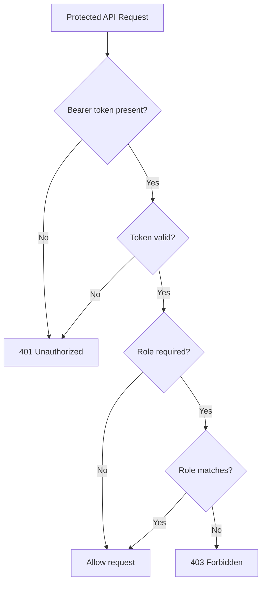

## 12.5 Security Hardening Recommendations

1. Add refresh token strategy
2. Login rate limiting
3. Centralized audit logs
4. Secret management through environment vault
5. CSRF and CORS policy refinement for production

---

# Chapter 13: Implementation Process and Key Engineering Decisions

## 13.1 Development Phases

1. Project bootstrap and folder setup
2. Data model and EF context creation
3. Auth services and controller setup
4. Product and category APIs
5. Cart + orders + payment flow
6. Frontend integration
7. Bug fixing and visual polish

## 13.2 Critical Engineering Decisions

### Decision 1: Server-Backed Cart as Source of Truth

Reason: prevents mismatch between UI and order APIs.

### Decision 2: Role in Token Claims

Reason: allows direct role checks without repeated DB calls for every endpoint.

### Decision 3: Startup Seed Data

Reason: stable demo setup and faster testing cycles.

## 13.3 Key Issues Encountered and Resolved

1. API port mismatch between frontend and backend
2. Cart displayed data differed from checkout source
3. Serialization behavior causing cart endpoint errors
4. Placeholder product images replaced with realistic assets

## 13.4 Final Quality Pass

- Harmonized styling
- Improved readability
- Verified flow behavior through API checks

---

# Chapter 14: Testing Strategy, Cases, and Results

## 14.1 Testing Approach

1. Endpoint-level validation
2. Integration flow testing
3. Role access testing
4. Regression checks after each fix

## 14.2 Test Categories

- Positive tests
- Negative tests
- Authorization tests
- Data consistency tests

## 14.3 Sample Test Cases

| Test ID | Module | Input | Expected Output | Result |
|---|---|---|---|---|
| TC-01 | Auth | Valid username/password | Token + user payload | Pass |
| TC-02 | Auth | Wrong password | Unauthorized | Pass |
| TC-03 | Cart | Add product | Cart count increments | Pass |
| TC-04 | Orders | Place order with empty cart | Error message | Pass |
| TC-05 | Orders | Place order with items | Order ID created | Pass |
| TC-06 | Admin | Update order status | Status changed | Pass |

## 14.4 End-to-End Flow Test

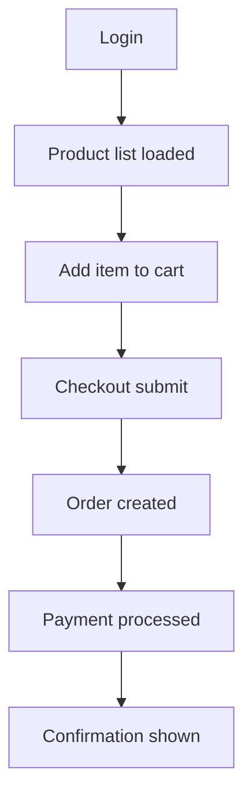

## 14.5 Reliability Notes

- Flow validated with demo users
- Cart/order path stable after source-of-truth fix
- Admin status update verified

## 14.6 Recommended Additional Tests

1. Load testing on product list endpoint
2. Concurrent cart update simulations
3. Automated API test collection integration

---

# Chapter 15: Deployment, Operations, and Maintenance

## 15.1 Local Development Deployment

Backend:

1. Open terminal in EcommerceAPI folder
2. Run: dotnet run
3. Confirm API and Swagger endpoint

Frontend:

1. Open terminal in ecommerce-ui folder
2. Run: npm start
3. Confirm UI at localhost:3000

## 15.2 Deployment Pipeline Model

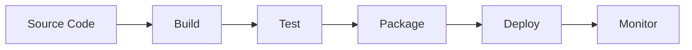

## 15.3 Production Checklist

1. Use environment-specific settings
2. Enable HTTPS and secure headers
3. Move secrets out of source config
4. Configure logging and alerts
5. Set backup and restore policy
6. Add health-check endpoint monitoring

## 15.4 Maintenance Plan

- Monthly dependency review
- Quarterly security audit checklist
- Periodic database backup validation
- Regular monitoring of failed auth patterns

---

# Chapter 16: Risk Assessment and Mitigation Strategy

## 16.1 Technical Risks

1. API service downtime
2. Unauthorized access attempts
3. Data inconsistency from future code changes
4. Dependency vulnerabilities

## 16.2 Project Risks

1. Scope expansion beyond timeline
2. Incomplete final evidence screenshots
3. Documentation mismatch with implementation

## 16.3 Mitigation Matrix

| Risk | Probability | Impact | Mitigation |
|---|---|---|---|
| API misconfiguration | Medium | High | Environment validation checklist |
| Auth abuse | Medium | High | Rate limit + lockout strategy |
| DB issues | Low | High | Backup policy + migration discipline |
| Scope creep | High | Medium | Freeze milestone and backlog rules |

## 16.4 Contingency Planning

- Keep rollback plan for deployment
- Maintain release notes per iteration
- Preserve backup snapshots before schema changes

---

# Chapter 17: Future Enhancement Roadmap

## 17.1 Business Enhancements

1. Coupon and discount engine
2. Wishlist support
3. User order history filters
4. Invoice and receipt generation

## 17.2 Technical Enhancements

1. Real payment gateway integration
2. Refresh tokens and stronger session management
3. Automated unit and integration test suite
4. CI/CD pipeline for auto-deploy

## 17.3 Product Intelligence Enhancements

1. Product recommendation model
2. Cart abandonment notifications
3. Sales and category analytics dashboard

## 17.4 Scalability Enhancements

1. Caching layer for product reads
2. Background worker for notifications
3. Optional microservice split by domain

---

# Chapter 18: Conclusion

This project successfully achieves the core requirements of a real-world inspired e-commerce system by combining secure authentication, role-based administration, database-backed cart and order flow, and a clear user interface. The implementation is practical, demonstrable, and modular. It can serve both as a final-year academic project and as a strong foundation for future production-level development.

From an engineering standpoint, the project demonstrates not only feature implementation but also debugging maturity, integration correctness, and architecture evolution based on observed runtime behavior. The final system is stable for demonstration and extensible for future development.

---

# Appendix A: API Payload Library

## A.1 Login Request

```json
{
  "username": "customer",
  "password": "password123"
}
```

## A.2 Login Response

```json
{
  "token": "<jwt>",
  "id": 2,
  "username": "customer",
  "email": "customer@ecommerce.com",
  "role": "Customer"
}
```

## A.3 Register Request

```json
{
  "username": "newuser",
  "email": "newuser@example.com",
  "password": "Password@123",
  "firstName": "New",
  "lastName": "User"
}
```

## A.4 Add Cart Item

```json
{
  "productId": 1,
  "quantity": 1
}
```

## A.5 Update Cart Quantity

```json
{
  "quantity": 3
}
```

## A.6 Place Order

```json
{
  "shippingAddress": "123 Main Street, City, State",
  "paymentMethod": "Credit Card"
}
```

## A.7 Process Payment

```json
{
  "orderId": 11,
  "cardNumber": "4242424242424242",
  "cardholderName": "Demo User",
  "expiry": "12/25",
  "cvv": "123"
}
```

---

# Appendix B: Flow Diagrams

## B.1 Registration Flow

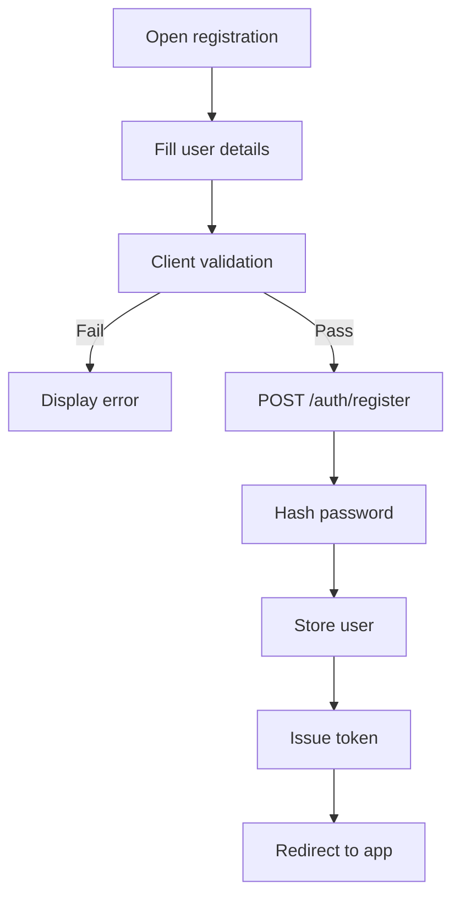

## B.2 Order Status State Diagram

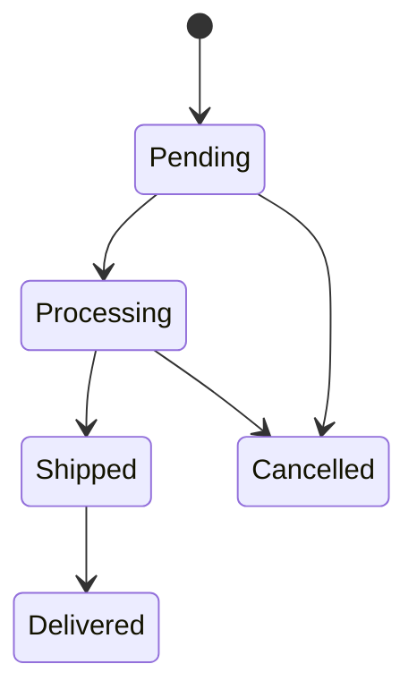

## B.3 Admin Product Management Flow

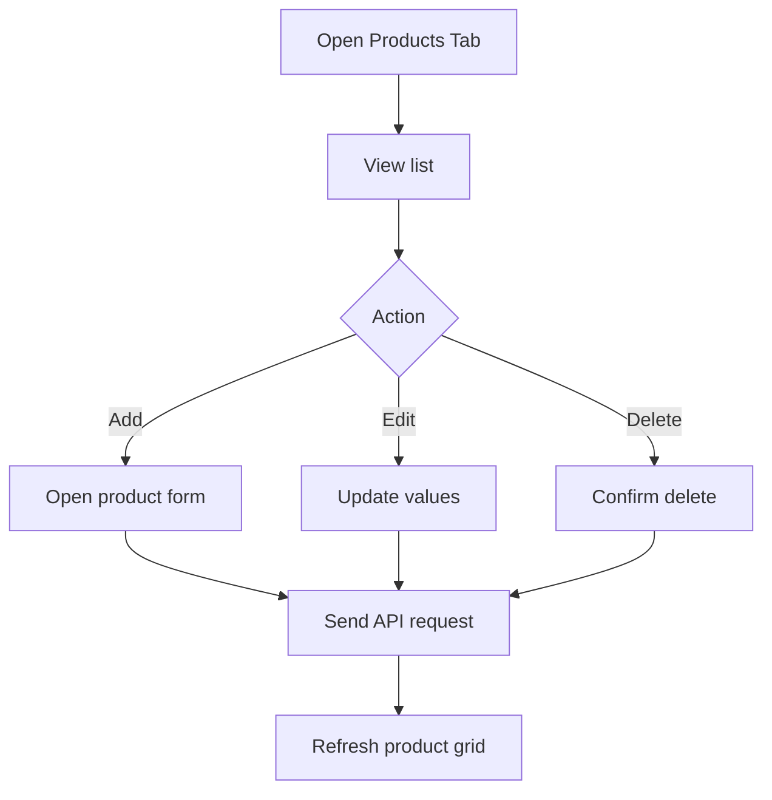

---

# Appendix C: User Manual

## C.1 Customer Login

1. Open the application URL.
2. Enter username and password.
3. Click Login.
4. On success, catalog page opens.

## C.2 Product Browsing

1. Use search box for product name.
2. Apply category filter.
3. Apply min/max price if required.

## C.3 Cart Actions

1. Click Add to Cart.
2. Open cart panel and review quantities.
3. Remove items if needed.

## C.4 Checkout

1. Proceed to checkout.
2. Fill shipping address.
3. Fill payment details.
4. Confirm and note order ID.

## C.5 Troubleshooting

- If login fails, verify correct username and password.
- If checkout shows cart issue, refresh and ensure item exists in cart.
- If API is not reachable, confirm backend server is running.

---

# Appendix D: Admin Manual

## D.1 Admin Access

1. Login using admin credentials.
2. Open dashboard interface.

## D.2 Orders Module

1. Navigate to Orders tab.
2. Review status and totals.
3. Update status from dropdown.

## D.3 Products Module

1. Navigate to Products tab.
2. Add or edit product details.
3. Delete obsolete items when needed.

## D.4 Categories Module

1. View current categories.
2. Validate product-category consistency.

## D.5 Admin Best Practices

- Avoid deleting products that are still active in operations.
- Track order status updates consistently.
- Validate price and stock values before save.

---

# Appendix E: Screenshot and Evidence Checklist

Use this checklist before final submission PDF export.

## E.1 UI Screenshots

1. Login page
2. Register page
3. Product listing with filters
4. Cart with items
5. Checkout step 1 (shipping)
6. Checkout step 2 (payment)
7. Confirmation screen
8. Admin orders tab
9. Admin products tab
10. Admin categories tab

## E.2 API Screenshots

1. Auth login endpoint success/failure
2. Product listing endpoint
3. Cart fetch endpoint
4. Order creation endpoint
5. Payment process endpoint

## E.3 Testing Evidence

1. Test case table screenshots
2. Endpoint response evidence
3. Bug-fix before/after evidence

## E.4 Deployment Evidence

1. Backend startup log
2. Frontend startup log
3. Running URLs screenshot

---

# Viva Preparation Notes (Optional Add-On)

## Common Questions and Suggested Answer Points

1. Why JWT instead of sessions?
Answer idea: Stateless architecture, scalable API consumption, easy role claim distribution.

2. Why keep cart on server?
Answer idea: Reliable checkout source, persistence across sessions, data consistency.

3. How is security handled?
Answer idea: BCrypt hashing, bearer token checks, role-based authorization.

4. How are orders created safely?
Answer idea: Server validates cart and stock, creates order records, updates stock, clears cart.

5. What improvements are planned?
Answer idea: Real payment integration, automated testing pipeline, analytics dashboard.

---

# References

1. Microsoft Learn - ASP.NET Core Web API documentation  
2. Microsoft Learn - Entity Framework Core documentation  
3. React official documentation  
4. OWASP Authentication and Session Management guidance  
5. RFC 7519: JSON Web Token specification

