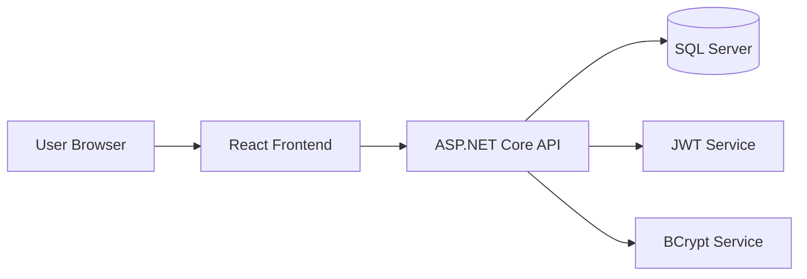
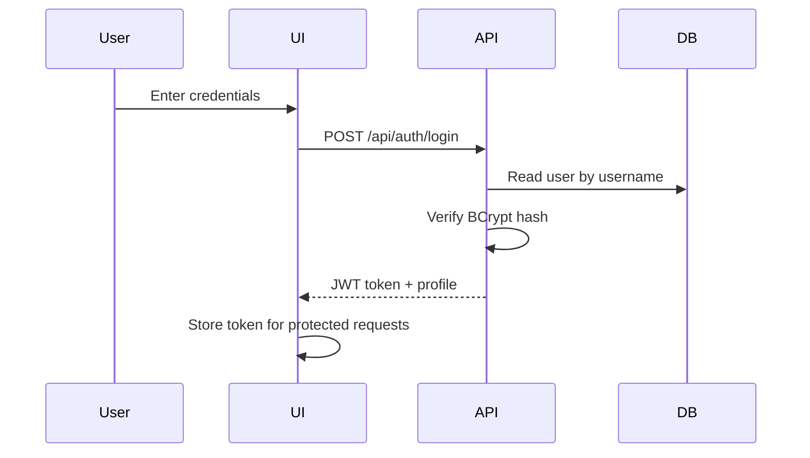
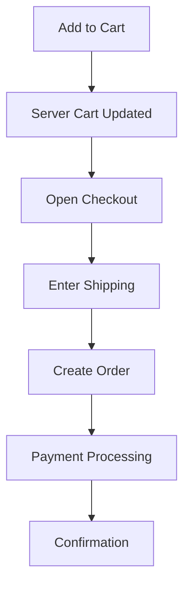
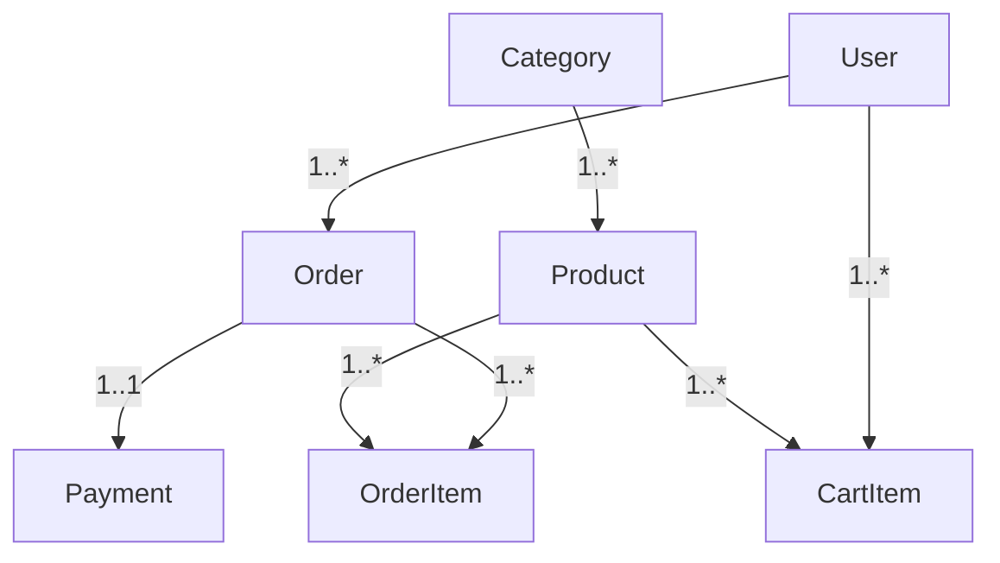

# E-Commerce Platform Presentation (Descriptive, Original Draft)

## Slide 1 - Title Slide

Title: Design and Development of a Full-Stack E-Commerce Platform  
Subtitle: React + ASP.NET Core + SQL Server  
Presented by: [Your Name]  
Institution: [College Name]  
Guide: [Guide Name]  
Date: [Presentation Date]

Speaker Notes:
This project demonstrates a complete online shopping platform with customer and admin workflows. The solution covers user authentication, product browsing, cart operations, order creation, payment simulation, and dashboard-level administration.

---

## Slide 2 - Presentation Roadmap

1. Problem and motivation
2. Objectives and scope
3. Technology stack
4. Architecture and workflow
5. Database design
6. Feature demonstration
7. Security and testing
8. Results and future scope

Speaker Notes:
This deck is structured to show both technical depth and practical outcomes. It follows the same sequence used in development: requirements first, design second, implementation third, validation last.

---

## Slide 3 - Problem Statement

Title: Why This Project Was Needed

- Basic commerce demos often miss real backend logic.
- Local-only cart designs break at checkout.
- Security is often limited or absent.
- Admin-level control is usually missing.

Speaker Notes:
The main issue with many mini-projects is that they simulate shopping behavior but do not implement a reliable transactional backend. This project was built to solve that gap with practical and secure workflows.

---

## Slide 4 - Project Goals

Title: Core Objectives

- Implement secure login and registration.
- Build searchable and filterable catalog.
- Maintain persistent server-backed cart.
- Complete order and payment flow.
- Provide admin tools for operations.

Speaker Notes:
The objective was not only to build pages, but to connect them with validated API logic and persistent database operations so the application behaves like a real commerce platform.

---

## Slide 5 - Scope Definition

Title: Included and Excluded Scope

Included:
- Authentication and authorization
- Product listing and filtering
- Cart, checkout, order, payment simulation
- Admin order and product management

Excluded in current version:
- Live payment gateway integration
- Recommendation engine
- Multi-vendor marketplace features

Speaker Notes:
Defining scope clearly helped keep the project achievable within timeline while still delivering strong end-to-end functionality.

---

## Slide 6 - Technology Stack

Title: Stack Used

Frontend:
- React
- Axios
- CSS

Backend:
- ASP.NET Core Web API
- Entity Framework Core
- SQL Server

Security:
- JWT
- BCrypt

Speaker Notes:
This stack was selected for maintainability, performance, and strong documentation support. It also reflects tools used in many production-grade enterprise applications.

---

## Slide 7 - High-Level Architecture

Title: System Architecture

Speaker Notes:
The frontend is a client that interacts with API endpoints. The backend handles business rules, validation, authorization, and database operations. Security services are embedded at the API layer.

---

## Slide 8 - User Roles

Title: Access Model

- Customer:
	- Browse products
	- Manage cart
	- Place orders and payments

- Admin:
	- Manage products
	- Track and update orders
	- Access administrative dashboard

Speaker Notes:
Role-based access is implemented in backend authorization. Sensitive operations are protected and available only to admin tokens.

---

## Slide 9 - Authentication Flow

Title: Login and Token Lifecycle

Speaker Notes:
Passwords are never stored in plain text. After login, the JWT token is included in future protected requests through the Authorization header.

---

## Slide 10 - Product Catalog Flow

Title: Product Discovery Experience

- API-driven product listing
- Search by name/description
- Filter by category and price
- Pagination support for scalability

Speaker Notes:
The product view is designed for both usability and performance. Query parameters let the backend return filtered datasets rather than sending everything at once.

---

## Slide 11 - Cart and Checkout Flow

Title: Cart to Order Conversion

Speaker Notes:
One major engineering fix in this project was ensuring checkout uses server-side cart data. This eliminated mismatch issues between UI cart and backend order validation.

---

## Slide 12 - Order Processing Logic

Title: Backend Order Workflow

- Read cart items by authenticated user
- Validate product stock
- Create order and order items
- Deduct stock quantity
- Initialize payment record
- Clear cart on success

Speaker Notes:
Order creation is handled in backend to ensure consistency and prevent client-side tampering.

---

## Slide 13 - Payment Module

Title: Payment Simulation Design

- Accepts order-linked payment details
- Marks payment status
- Stores transaction metadata
- Supports refund endpoint for admin tests

Speaker Notes:
Current implementation uses mock processing for demonstration. The module is structured so real gateway integration can be added in future.

---

## Slide 14 - Admin Dashboard

Title: Admin Features

- Orders tab:
	- View all orders
	- Update order statuses

- Products tab:
	- Create, update, delete products

- Categories tab:
	- View and organize category data

Speaker Notes:
The dashboard is role-protected and built for operational control. This helps simulate real business workflows beyond customer shopping.

---

## Slide 15 - Database Model

Title: Core Data Entities

- User
- Product
- Category
- CartItem
- Order
- OrderItem
- Payment

Speaker Notes:
Entity relationships are structured to preserve order history and maintain transaction integrity.

---

## Slide 16 - ER Relationship Diagram

Speaker Notes:
This relationship map ensures each business event has a consistent and queryable record.

---

## Slide 17 - Security Implementation

Title: Security Layers

- BCrypt password hashing
- JWT token validation
- Role-based authorization
- Input validation and error handling
- SQL injection protection via ORM

Speaker Notes:
Security was implemented as a baseline requirement, not as an optional improvement.

---

## Slide 18 - Testing Strategy

Title: Validation Approach

- Auth tests: valid and invalid credentials
- Cart tests: add/update/remove
- Order tests: empty cart and valid checkout
- Admin tests: role-protected operations
- Regression checks after each major fix

Speaker Notes:
Testing focused on critical business workflows and security boundaries.

---

## Slide 19 - Sample Test Results

| Module | Scenario | Expected | Status |
|---|---|---|---|
| Auth | Valid login | Token returned | Pass |
| Cart | Add product | Cart count increases | Pass |
| Orders | Place with empty cart | Controlled error | Pass |
| Orders | Place with items | Order created | Pass |
| Admin | Update status | Status changed | Pass |

Speaker Notes:
The system passed functional test cases for all core modules. Remaining improvements are mostly around scale and automation.

---

## Slide 20 - Challenges and Fixes

Title: Practical Issues Resolved

- API port mismatch between frontend and backend
- Cart source mismatch during checkout
- Serialization issue in cart API response
- Placeholder image content replaced with real product visuals

Speaker Notes:
These fixes significantly improved functional stability and user experience.

---

## Slide 21 - Final Outcomes

Title: What Was Achieved

- Complete end-to-end shopping workflow
- Secure user and admin access model
- Stable order lifecycle implementation
- Clean and polished frontend interface
- Comprehensive technical documentation

Speaker Notes:
The project satisfies the planned goals and is ready for academic evaluation and live demonstration.

---

## Slide 22 - Future Scope

Title: Enhancement Roadmap

- Integrate live payment gateway
- Add refresh tokens and advanced session management
- Add recommendation engine
- Add analytics dashboards
- Introduce CI/CD and automated test suites

Speaker Notes:
The current architecture supports growth, so these features can be added incrementally without redesigning the core system.

---

## Slide 23 - Conclusion

Title: Project Summary

This project demonstrates a full-stack e-commerce implementation with practical architecture, secure authentication, role-based access, transactional consistency, and admin operations. It is both academically complete and technically extensible.

Speaker Notes:
The key success of this project is not just feature completion, but integration correctness across UI, API, and database.

---

## Slide 24 - Thank You

Title: Questions and Discussion

Thank you for your time.  
I welcome questions about architecture, implementation, security, and testing.

Speaker Notes:
Be prepared to explain why server-backed cart and JWT role checks were critical decisions in this project.

---

## Anti-Plagiarism Note for Submission

To keep this deck plagiarism-safe in your final submission:

1. Replace placeholders with your actual name, guide, and institution details.
2. Insert your own screenshots from your running project.
3. Add your own test logs and command outputs.
4. Keep the wording but customize at least 10-20 percent with your personal implementation experience.
5. Cite external references for JWT, BCrypt, and framework docs in final slide notes.

